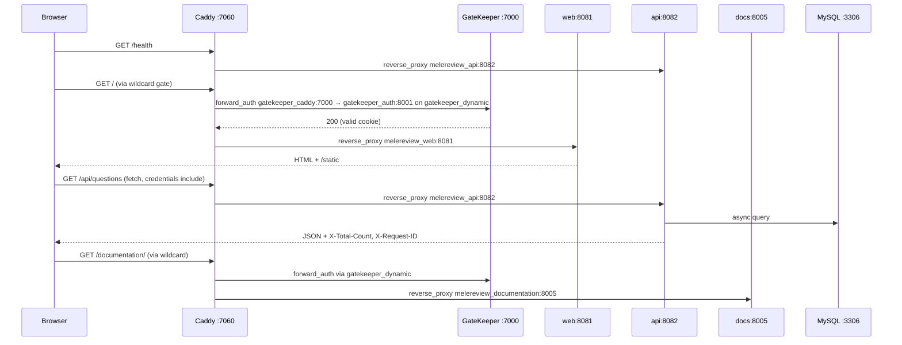
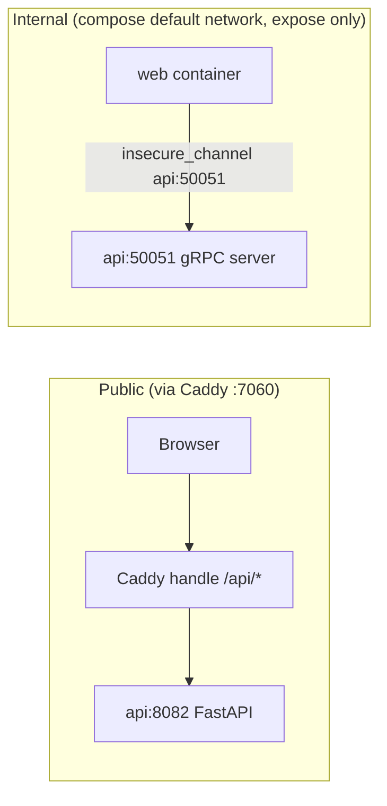

# Architecture

**Stack:** FastAPI + Granian (ASGI). Two deployable sectors (`api`, `web`) + `mysql-db` + `caddy` + `documentation`. Builds use `python:3.14-slim`, multi-stage `--prefix=/install`, `USER appuser --uid 10001`.

## Process Layout

```text
api/     backend (8082): SQLAlchemy async + REST + thermo solver + gRPC :50051
web/     frontend (8081): Jinja2 pages + StaticFiles; browser calls /api/* via Caddy
caddy/   reverse proxy :7060 — handle /health (public), /api/* -> api, /static/* cached, /* -> web, /documentation/* -> docs (gated)
documentation/  MkDocs Material site on 8005, served as its own container, gated via forward_auth
mysql-db MySQL 8.4, named volume mysql_data, healthcheck mysqladmin ping
```

## Request Flow



## HTTP vs gRPC Boundary (house style)

| Traffic | Protocol | Endpoint | Channel / Proxy | Auth |
|---------|----------|----------|-----------------|------|
| Browser / webhook / public caddy → api | HTTP | FastAPI `APIRouter(prefix="/api")` on `api:8082` | Caddy `handle /api/*` + `reverse_proxy melereview_api:8082` | Session cookie + GateKeeper wildcard gate on `gatekeeper_dynamic` |
| `web` container → `api` server-side (when needed) | gRPC | `grpc.aio.server` on `melereview_api:50051` | `grpc.aio.insecure_channel("melereview_api:50051")` on internal network | `X-Internal` metadata or session reuse; TLS terminated at Caddy/cloudflared |
| `api:50051` internal | gRPC | Expose only | Never `ports:`-published | Internal DNS only |

- **Public:** always HTTP via Caddy. Browsers never dial `50051`.
- **Internal:** `gRPC` for container-to-container server-side calls (worker→api, `web`→api when it needs server-side question fetch). The API container runs both `FastAPI :8082` and `grpc.aio.server :50051` in the same process via lifespan (or a small `grpc_server.py` entrypoint). If your frontend only serves static HTML and the browser does `fetch("/api/...")`, you do **not** need gRPC — plain HTTP via Caddy is correct.



Proto package is `api.v1` and stays aligned with HTTP prefix `/api` (breaking proto bumps to `v2`). Business logic lives in `*_service.py`, called by both the HTTP route and the gRPC servicer — no duplication.

### When NOT to use gRPC

If `web` never makes server-side calls to `api` (current MELEReview shape: the browser fetches via Caddy), the gRPC server is scaffolding — kept internal, documented, and available for future server-side enrichment (e.g., SSR question preload).

## Networks and DNS

Docker's `cloudflared-tunnel_default` and `gatekeeper_default` are **shared across every project** — Caddy proxies to `container_name` (`melereview_api`, `melereview_web`, `melereview_documentation`), never the service name `app`, to avoid the shared-network DNS collision.

```yaml
services:
  caddy:
    networks: [default, gatekeeper_dynamic, cloudflared-tunnel]
  melereview_api:
    expose: ["8082", "50051"]  # 50051 expose only, never ports:
    networks: [default]
  melereview_web:
    expose: ["8081"]
    networks: [default]
  melereview_documentation:
    expose: ["8005"]
    networks: [default]
  mysql-db:
    networks: [default]
```

## Config and Lifespan

- `api/config.py` frozen `Settings` via `pydantic-settings`; env from compose interpolation (`${VAR:?VAR is required}`), no `.env` file.
- `DEPLOYMENT_TYPE` selects `DEBUG` vs `PRODUCTION` (structlog JSON, CORS, cookie `Secure`).
- `api/app.py` `lifespan` runs adaptive DB migration (3 cases: table missing → `create_all`, column missing → `ADD COLUMN`, size mismatch → clip guard via `func.char_length` before `MODIFY`). Always wraps `ALTER TABLE` batches with `SET FOREIGN_KEY_CHECKS=0/1` on the same connection.
- `X-Request-ID` middleware binds `request_id` (+ `account_id` when authed) to structlog context; every response exposes `X-Request-ID` and `X-Total-Count`.

## Frontend

- `web/routes.py` — `APIRouter` of page routes (`/`, `/login`, `/questions`, `/calculators/*`, `/health`), `Jinja2Templates`, `StaticFiles` mounted at `/static`.
- `web/static/` per-page JS, `web/templates/base.html` 2-level inheritance. Page JS uses `fetch(..., {credentials:"include"})` via Caddy (no direct `api:8082` hop from the browser).
- `web/grpc_client.py` — `grpc.aio.insecure_channel("melereview_api:50051")` helper for future server-side calls (see API docs).
