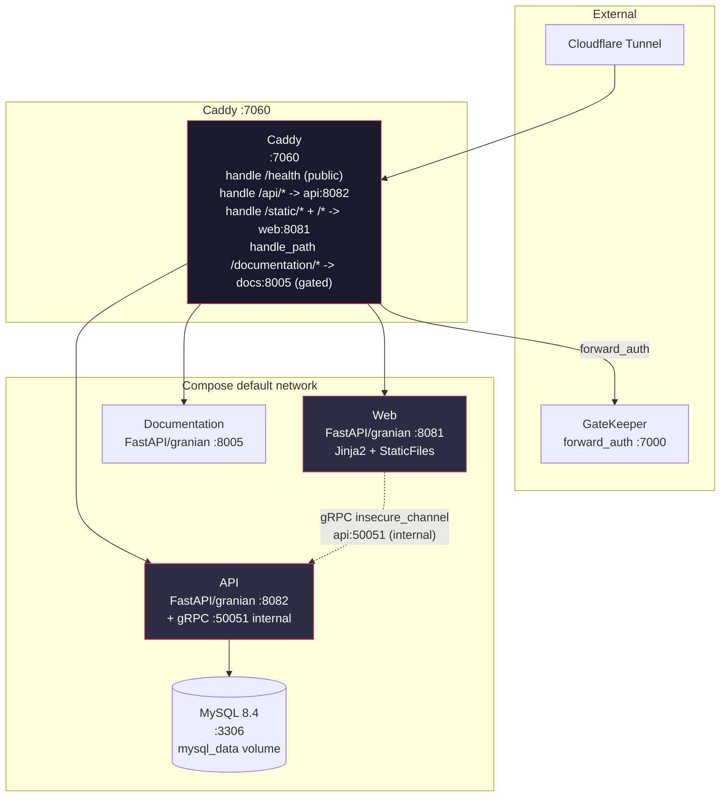

# MELE Review

Board-exam reviewer for Philippine Mechanical Engineering licensure exams — question bank with per-user solutions, login/account system, and a suite of ME calculators including the thermodynamic cycle solver.

**Stack:** Python 3.14 + FastAPI + Granian + CoolProp + MySQL 8.4; Caddy gateway. Alembic for migrations, Ruff + Mypy + pre-commit, structlog JSON logging with X-Request-ID tracing.

## Services Overview

| Service | Container | Internal Port | Caddy Route | Network |
|---------|-----------|---------------|-------------|---------|
| **Caddy Gateway** | `melereview_caddy` | 7060 | — | default, gatekeeper_dynamic, cloudflared |
| **API** | `melereview_api` | 8082 | `/api/*` (7060), `/health` | default |
| **Web** | `melereview_web` | 8081 | `/*` (7060), `/static/*` cached | default |
| **Documentation** | `melereview_documentation` | 8005 | `/documentation/*` (7060) | default |
| **MySQL 8.4** | `melereview_db` | 3306 | — | default |

- Single Caddy entrypoint on `:7060` (loopback `127.0.0.1:7060:7060`).
- All browser traffic goes through Caddy `handle /api/*` → `melereview_api:8082`; the web frontend is pure server-rendered HTML, the browser does `fetch("/api/...")` via Caddy.
- Internal container-to-container traffic (web → api) also available via **gRPC** on `melereview_api:50051` (`grpc.aio.insecure_channel("melereview_api:50051")`), with HTTP via Caddy as the public surface — see [Architecture](architecture.md) and [API Reference](api/index.md).
- Every Python service is a **FastAPI app run by granian** (ASGI, 1 worker).

## Features

- **Accounts** — Netflix-style login: pick a profile, enter its pin. Stored with plain pins (low-value tool) + signed session cookie (`itsdangerous`).
- **Questions** — multiple-choice, many tags, search + tag filter, `active` toggle, `X-Total-Count` pagination, answer-feedback.
- **Solution Blocks** — typed JSONB (`text`, `math`, `image`) validated by Pydantic `Block` union, rendered via `createBlocksEditor`.
- **Thermo Solver** — Carnot, Otto, Diesel, Dual, Brayton, Rankine, vapor-compression with T-s/P-v diagrams (Plotly + CoolProp, no tables).
- **Calculators** — unit converter, fluids, strength, heat transfer, psychrometrics, machine design.

## Architecture Diagram

See [Architecture](architecture.md) for request flow, networks, and gRPC vs HTTP boundaries.
